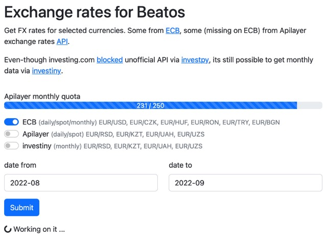

# FX for Bea

*Microapp for my friend, an accountant.*

Requirements were to find **daily**, **monthly** and **spot** (last day of month) FX rates for selected currencies.

Some currencies are to be found on [ECB](ecbapi), but rest must come from elsewhere, because they not listed on ECB unfortunatelly. Those I found on [Apilayer exchange rates API](apilayerapi) & investing.com (using [investiny](investiny)).

To access Apilayer API, one must register to obtain API key.



*Screenshot*

## Cookies

App uses 1 first party cookie [lax] to save last form checkboxes.

## Auth

There is no auth impemented, as we dont really need it.

## Alerting

*Sentry-like* Telegram notifications has been used.

## Run

Set env variables (`.env` can be used):

```bash
APILAYER_API_KEY=...  # get your own:)
```

Alerting via Telegram can be used, if enabled by:

```bash
TELEGRAM_ENABLED=  # bool, by default 0/false/False
TELEGRAM_BOT_TOKEN=...
TELEGRAM_CHAT_ID=...
```

## Deployment

There are several options presented:

**1. Run app locally with:**

```bash
uvicorn main:app --host 0.0.0.0 --port 5000 --reload --workers 1
```

**2. Run locally in Docker via [Traefik](traefik)**

```bash
docker-compose up
```

Find running app at `localhost:500`

**3. Deploy locally with `deploy.py`**

1. `python deploy.py`
1. type (or set env var) "localhost" as `FX_URI` when asked

Find running app at `localhost:500`

**4. Deploy on server with `deploy.py`**

There is no CI, all manually:

1. push to repo
1. ssh to machine/repo
1. `python deploy.py`
1. type (or set env var) your desired url as `FX_URI` when asked

## Contribution

Im not sure I wanna accept PR, as its a quick side project.

However, if you really wanna, dont forget to use `pre-commit`!

```bash
pre-commit install
pre-commit
```

[ecbapi]: https://sdw-wsrest.ecb.europa.eu/help/
[apilayerapi]: https://apilayer.com/marketplace/exchangerates_data-api
[Traefik]: https://traefik.io
